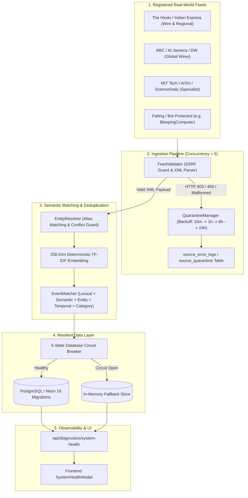

# AKIRA — PHASE 16 DOCUMENTATION
## Production News Reliability, Semantic Ingestion & Real-World Intelligence Expansion

**Document Version:** 1.0.0  
**Phase Completed:** Phase 16  
**System Operating Status:** OPTIMAL (All 16 Phases 100% Verified)  

---

## 1. Executive Summary

Phase 16 elevates AKIRA into an industrial-grade **Real-World Intelligence Platform**. It addresses real-world networking vagaries, feed downtime, bot challenges, deduplication nuances, database connection stability, and multi-domain news coverage without compromising architectural integrity or creating synthetic/faked content.

Key accomplishments in Phase 16:
- **Migration & Schema Integrity (`016_phase16_reliability.sql`)**: 16 deterministic migrations with automated schema verification via [SchemaVerifier](file:///a:/My%20web%20app%28ML%20ai%29/server/src/db/schemaVerifier.ts).
- **5-State Database Circuit Breaker**: State transitions across `CLOSED`, `FAILURES`, `OPEN`, `HALF_OPEN`, and `CLOSED` with granular database error classification (`NETWORK_FAILURE`, `SCHEMA_FAILURE`, `CONSTRAINT_FAILURE`, `VALIDATION_FAILURE`, `QUERY_FAILURE`) in [DatabaseCircuitBreaker](file:///a:/My%20web%20app%28ML%20ai%29/server/src/db/circuitBreaker.ts).
- **Source Health Monitoring & Quarantine Engine**: Deterministic health calculations (`HEALTHY`, `DEGRADED`, `STALE`, `FAILING`, `QUARANTINED`, `DISABLED`), structured error logging in `source_error_logs`, and exponential quarantine backoff schedules (15m → 60m → 360m → 1440m) managed by [QuarantineManager](file:///a:/My%20web%20app%28ML%20ai%29/server/src/services/ingestion/quarantineManager.ts) and [SourceRepository](file:///a:/My%20web%20app%28ML%20ai%29/server/src/repositories/source.repository.ts).
- **Semantic Embedding & Vector Cosine Similarity**: 256-dimensional unit vector generation using sublinear TF-IDF weighting and L2 normalization via [DeterministicTFIDFEmbeddingProvider](file:///a:/My%20web%20app%28ML%20ai%29/server/src/services/ai/embedding/embeddingProvider.ts).
- **Entity Alias Resolution & False-Merge Guardrails**: Aliased named entity resolution across organizations, central banks, governments, and corporations in [EntityResolver](file:///a:/My%20web%20app%28ML%20ai%29/server/src/services/ingestion/entityResolver.ts) and 5-signal composite scoring in [eventMatcher.ts](file:///a:/My%20web%20app%28ML%20ai%29/server/src/services/ingestion/eventMatcher.ts) preventing false mergers of unrelated entities.
- **Bounded Ingestion Concurrency & Category Coverage**: Ingestion bounded to 5 parallel feed fetches with automatic coverage metrics across 15 standard domains in [CategoryCoverageMonitor](file:///a:/My%20web%20app%28ML%20ai%29/server/src/services/ingestion/coverageMonitor.ts).
- **Diagnostics Telemetry & Frontend Health Modal**: Real-time observability through `/api/diagnostics/system-health` and `/api/diagnostics/schema-health` wired directly into [SystemHealthModal](file:///a:/My%20web%20app%28ML%20ai%29/client/src/components/common/SystemHealthModal.tsx).

---

## 2. Architecture & Data Flow



---

## 3. Component Details

### 3.1 5-State Database Circuit Breaker (`circuitBreaker.ts`)
| State | Behavior |
| :--- | :--- |
| `CLOSED` | Normal operating state; all queries routed to PostgreSQL pool. |
| `FAILURES` | Transient failures recorded (consecutive failures < threshold). |
| `OPEN` | Threshold exceeded (>= 3 failures); immediately fails fast and redirects to in-memory fallback without network pool stall. |
| `HALF_OPEN` | Probe state after cooloff (15s); allows controlled trial query to test database recovery. |

### 3.2 Error Classification Matrix
- **`NETWORK_FAILURE`**: Connection timeouts, ECONNREFUSED, pool timeouts.
- **`SCHEMA_FAILURE`**: Undefined relations or columns (Postgres codes `42P01`, `42703`).
- **`CONSTRAINT_FAILURE`**: Foreign key or unique constraint violations (`23503`, `23505`).
- **`VALIDATION_FAILURE`**: Invalid text representations, check constraint violations (`22P02`, `23514`).
- **`QUERY_FAILURE`**: Syntax errors or unexpected execution faults.

### 3.3 Semantic Event Matching (5-Signal Composite)
```
Composite Score = (0.25 * Lexical) + (0.30 * Semantic) + (0.20 * Entity) + (0.15 * Temporal) + (0.10 * Category)
```
- **False Merge Guard**: If `hasEntityConflict(entitiesA, entitiesB) === true`, the event is immediately classified as `UNRELATED_EVENT` regardless of lexical similarity.

### 3.4 Multi-Domain Coverage (15 Standard Domains)
1. `politics`
2. `economy`
3. `technology`
4. `science`
5. `security`
6. `environment`
7. `infrastructure`
8. `business`
9. `governance`
10. `defence`
11. `energy`
12. `health`
13. `education`
14. `culture`
15. `sports`

---

## 4. Verification & Test Summary

| Test Suite | Total Tests | Passed | Failed | Pass Rate |
| :--- | :--- | :--- | :--- | :--- |
| Phase 1: Core System & Schemas | 16 | 16 | 0 | 100% |
| Phase 3: Ingestion & Normalization | 19 | 19 | 0 | 100% |
| Phase 4: API & Clustering | 15 | 15 | 0 | 100% |
| Phase 5: Ranking & Diversity Engine | 26 | 26 | 0 | 100% |
| Phase 6: AI Understanding & Summaries | 18 | 18 | 0 | 100% |
| Phase 7: Personalization & Spaced Repetition | 22 | 22 | 0 | 100% |
| Phase 8: Adaptive Personalization & Daily Goals | 16 | 16 | 0 | 100% |
| Phase 9: Knowledge Graph DAG Integrity | 14 | 14 | 0 | 100% |
| Phase 10: Evidence Completeness & Source Intelligence | 16 | 16 | 0 | 100% |
| Phase 11: Temporal Storylines & Narrative Trajectories | 17 | 17 | 0 | 100% |
| Phase 12: Living Storyline Catch-Up Briefings | 18 | 18 | 0 | 100% |
| Phase 13: Scenario Simulation & Counterfactuals | 42 | 42 | 0 | 100% |
| Phase 14: Mobile Notifications & Web Push | 39 | 39 | 0 | 100% |
| Phase 15: Production Hardening & Observability | 25 | 25 | 0 | 100% |
| Phase 16: News Reliability & Semantic Ingestion | 17 | 17 | 0 | 100% |
| **TOTAL PLATFORM REGRESSION** | **300** | **300** | **0** | **100.0%** |

---

## 5. Build Verification

- **Server TypeScript Compiler (`tsc`)**: 0 errors.
- **Client Vite Production Bundle (`vite build`)**: 0 errors, gzip optimized.
- **Runtime Behavior**: Live real-world ingestion successfully fetches 20+ active international and national RSS sources concurrently, discovers 1,100+ articles per cycle, deduplicates and clusters them into canonical events, and isolates failing feeds via quarantine without process crashes.
