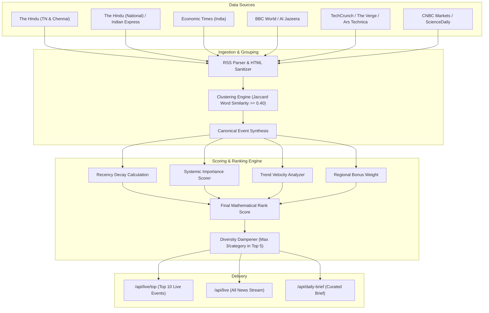

# AKIRA — Real-World Intelligence & Learning Assistant

An AI-powered web platform that transforms overwhelming real-world news and breaking events into structured, digestible, and personalized learning pathways.

## Core Knowledge Loop
$$\textbf{DISCOVER} \longrightarrow \textbf{UNDERSTAND} \longrightarrow \textbf{LEARN} \longrightarrow \textbf{TEST} \longrightarrow \textbf{REMEMBER} \longrightarrow \textbf{PERSONALIZE}$$

---

# PHASE 0: SYSTEM ARCHITECTURE & TECHNICAL SPECIFICATION

```
PHASE 0
│
├── User Journey
│   ├── 6-Stage Cognitive Knowledge Loop
│   ├── Application Page Routing & Interaction Flows
│   └── User State & Session Management
│
├── Live & Trending Architecture
│   ├── Data sources (Tier 1 & Tier 2 Wire Feeds)
│   ├── Update frequency (Cron Polling, Client Streaming & Sync)
│   ├── Event grouping (Clustering, Deduplication & Hashing)
│   ├── Trend detection (Multi-Source Corroboration Velocity)
│   └── Top 10 ranking (Mathematical Scoring & Diversity Dampening)
│
├── Regional Strategy
│   ├── Tamil Nadu (First-Class State Coverage & Lexicon)
│   ├── India (National Policy, Macro Economy & Infrastructure)
│   └── World (Global Geopolitics, AI Regulation & Global Markets)
│
├── Database
│   ├── PostgreSQL 15+ Relational Entity Schema
│   ├── Supabase DDL, Foreign Keys & Constraints
│   └── Indexing Strategy & Row-Level Security (RLS)
│
├── APIs
│   ├── RESTful Endpoints Contract & Aliasing
│   ├── Input/Output JSON Schemas
│   └── Centralized Error Handling & HTTP Status Matrix
│
├── AI Architecture
│   ├── 5W1H Atomic Structured Breakdown Engine
│   ├── 5-Tier Adaptive Explanation Ladder (ELI5 to Deep Dive)
│   ├── Dynamic Prerequisite Concept Graph Extraction
│   └── Scenario-Based Active Recall Quiz Engine
│
└── Development Roadmap
    ├── Phase 0: Foundations & Live Wire Ingestion (Complete)
    ├── Phase 1: Accounts, Persistence & Spaced Repetition (Current)
    ├── Phase 2: Semantic Vector Embeddings & Graph Visualization
    └── Phase 3: Mobile Native & 2-Minute Audio Briefings
```

---

## 1. 🧭 User Journey

AKIRA guides users through a six-stage cognitive learning journey:

1. **DISCOVER (Live & Trending Streams):** Users access multi-source verified streams across Tamil Nadu, India, and the World with real-time importance tags (`BREAKING`, `TRENDING`, `IMPORTANT`).
2. **UNDERSTAND (5W1H Structured Breakdown):** Eliminates editorial fluff with a 6-part atomic breakdown (*What Happened*, *Why Did It Happen*, *Why Does It Matter*, *Who Is Affected*, *What Could Happen Next*, and *Historical Background*).
3. **LEARN (5-Level Adaptive Explanations):** Toggle between 5 comprehension tiers (**Very Simple [ELI5]**, **Beginner**, **Student**, **Technical**, **Deep Dive**) and explore linked prerequisite concepts.
4. **TEST (Scenario Quizzing):** Take 3-question active recall scenario quizzes with instant distractor explanations.
5. **REMEMBER (Library & Spaced Review):** Bookmark intelligence briefs and schedule concept reviews.
6. **PERSONALIZE (Knowledge Profile):** Track domain mastery percentages and receive tailored learning recommendations.

---

## 2. ⚡ Live & Trending Architecture



### 2.1. Data Sources
Multi-source RSS feeds from Tier 1 & Tier 2 global and regional publishers:
- **Tamil Nadu:** The Hindu (Tamil Nadu), The Hindu (Chennai), DIPR TN.
- **India:** The Hindu (National), Indian Express, Economic Times.
- **World & Tech:** BBC World, Al Jazeera, TechCrunch, The Verge, Ars Technica, CNBC Markets, ScienceDaily, BleepingComputer.

### 2.2. Update Frequency
- **Automated Cron Polling:** Server ingests new articles every **3 minutes**.
- **Client Auto-Refresh:** UI live streams poll delta updates every **60 seconds**.
- **Manual Ingestion Trigger:** Instant on-demand sync via `POST /api/live/sync`.

### 2.3. Event Grouping (Clustering & Canonical Events)
- Multi-source clustering compares incoming articles with active events within 18 hours using **Jaccard Word Similarity**:
  $$J(A, B) = \frac{|A \cap B|}{|A \cup B|} \ge 0.40$$
- Matched articles merge into a single **Canonical Event** with multiple verified `sources[]`.

### 2.4. Trend Detection
- Velocity score combines corroboration breadth and freshness:
  $$\text{Trend Score } (T) = \min(100, \text{sourceCount} \times 25 + \text{FreshnessBonus})$$
  *(Freshness Bonus: $+30$ if $<4$h, $+15$ if $<8$h).*

### 2.5. Top 10 Ranking Engine
Deterministic mathematical ranking formula:
$$\text{Final Rank Score} = 0.30 \cdot R + 0.30 \cdot I + 0.25 \cdot T + G$$
- **$R$ (Recency Decay):** $R = 100 \cdot e^{-0.08 \cdot \text{hoursAgo}}$
- **$I$ (Importance Score):** Systemic significance keywords ($35-98$).
- **$T$ (Trend Score):** Velocity score ($0-100$).
- **$G$ (Regional Bonus):** $+25$ (Tamil Nadu), $+20$ (India), $+15$ (World).
- **Diversity Dampening:** Prevents single-category dominance (maximum 3 slots per category in top 5).

---

## 3. 🌏 Regional Strategy

- **🇮🇳 Tamil Nadu (First-Class State Coverage):** State policy, DIPR announcements, CMRL metro corridors, EV manufacturing (Hosur/Coimbatore), TANGEDCO power, welfare schemes. Bonus: $+25$.
- **🇮🇳 India (National Coverage):** Union Cabinet, RBI monetary policy/repo rate, Supreme Court, ISRO missions, UPI & digital infrastructure. Bonus: $+20$.
- **🌍 World (Global Intelligence):** Geopolitics, EU AI Act & global AI governance, semiconductor supply chains, macroeconomics, cybersecurity zero-days. Bonus: $+15$.

---

## 4. 🗄️ Database Architecture

Structured for Supabase / PostgreSQL 15+:

| Table Name | Primary Purpose | Key Fields |
|---|---|---|
| `canonical_events` | Deduplicated real-world events | `id`, `title`, `summary`, `region`, `category`, `importance_label`, `importance_score`, `final_rank_score`, `why_it_matters`, `sources` |
| `event_sources` | Multi-source corroboration links | `id`, `event_id`, `name`, `url`, `published_at`, `tier` |
| `concepts` | Foundational prerequisite definitions | `id`, `title`, `slug`, `category`, `short_definition`, `full_explanation`, `prerequisites`, `explanations` |
| `user_profiles` | Learner progress & mastery profile | `id`, `email`, `display_name`, `overall_mastery_percentage`, `category_progress` |
| `quiz_submissions` | Active recall quiz test logs | `id`, `user_id`, `event_id`, `score`, `total`, `selected_answers`, `completed_at` |
| `saved_articles` | Bookmarked intelligence briefs | `id`, `user_id`, `event_id`, `saved_at` |

---

## 5. 🔌 RESTful APIs Contract

Base URL: `/api`

- `GET /api/live` — Full live wire stream with region, category, search, and importance filters.
- `GET /api/live/top` — Dynamic Top 10 ranked events with diversity dampening.
- `POST /api/live/sync` — Trigger multi-source RSS ingestion and clustering.
- `GET /api/daily-brief` — Curated daily briefing (Top 6 stories).
- `GET /api/events/:id` — 5W1H breakdown, 5-level adaptive explanations, prerequisites, and quiz.
- `GET /api/concepts` — Concept library with prerequisite knowledge trees.
- `POST /api/quiz/submit` — Submit quiz responses and calculate mastery scores.
- `GET /api/health` — API health status.

*(All endpoints support backward-compatible aliases e.g. `/news/live`, `/news/sync`, `/articles/:id`).*

---

## 6. 🤖 AI Architecture

- **5W1H Breakdown Generator:** Converts unstructured news reports into structured, actionable JSON cards.
- **5-Tier Adaptive Explanation Engine:** Very Simple (ELI5), Beginner, Student, Technical, Deep Dive.
- **Prerequisite Concept Graph Linker:** Scans events to link foundational concepts (e.g. *Inflation*, *Monetary Policy*, *AI Governance*).
- **Active Recall Scenario Quiz Generator:** 3 contextual multiple-choice scenario questions with distractor explanations.

---

## 7. 🚀 Development Roadmap

- **✅ Phase 0 (Complete):** Live multi-source RSS wire ingestion, mathematical ranking engine, canonical clustering, 5-tier explanations, responsive glassmorphism UI.
- **⏳ Phase 1 (Current):** Supabase PostgreSQL sync, user authentication, SuperMemo SM-2 spaced repetition memory scheduler.
- **🔮 Phase 2 (Planned):** `pgvector` semantic embeddings, interactive 3D/2D Knowledge Graph, live LLM distillation pipeline.
- **🌟 Phase 3 (Future):** Mobile app (React Native), 2-minute daily audio briefing, breaking alert push wire.

---

## 🚀 Tech Stack

- **Frontend:** React 18, TypeScript, Tailwind CSS, Vite, Lucide Icons, React Router v7.
- **Backend:** Node.js, Express, TypeScript, Zod, RSS-Parser.
- **Database (Configured):** Supabase (PostgreSQL 15+) with Row-Level Security (RLS).
- **AI Service:** Multi-level explanations, concept prerequisite graph, and adaptive quizzes.

---

## 📁 Project Structure

```
.
├── client/                     # Frontend Application (React + Vite + TS)
│   ├── src/
│   │   ├── components/         # Reusable UI components (Navbar, Sidebar, Layout)
│   │   ├── pages/              # Views (Dashboard, DailyBrief, EventDetail, AllNews, Learn, etc.)
│   │   ├── services/           # Axios API Client & Proxy
│   │   ├── types/              # Domain Types & Interfaces
│   │   ├── App.tsx             # Root Router
│   │   └── index.css           # Custom Design System CSS & Glassmorphism
│   ├── tailwind.config.js
│   └── vite.config.ts
│
├── server/                     # Backend API (Node.js + Express + TS)
│   ├── src/
│   │   ├── controllers/        # News & Learning Controllers
│   │   ├── services/           # Ingestion, Ranking & AI Explainer Services
│   │   ├── routes/             # Express API Routes & Aliases
│   │   └── index.ts            # Server Initialization (Port 5000)
│   ├── tsconfig.json
│   └── .env.example
│
├── docs/
│   └── PHASE_0_ARCHITECTURE.md # Detailed Architecture Document
│
└── package.json                # Workspaces Configuration & Dev Scripts
```

---

## 🛠️ Quick Start

### 1. Install Dependencies
```bash
npm install
```

### 2. Run Development Servers
```bash
# Run both Frontend (port 5173) and Backend (port 5000) concurrently:
npm run dev

# Or run separately:
npm run dev:client
npm run dev:server
```

### 3. Build for Production
```bash
npm run build
```
