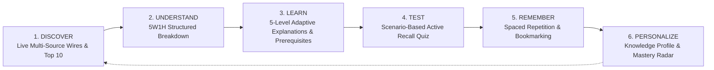
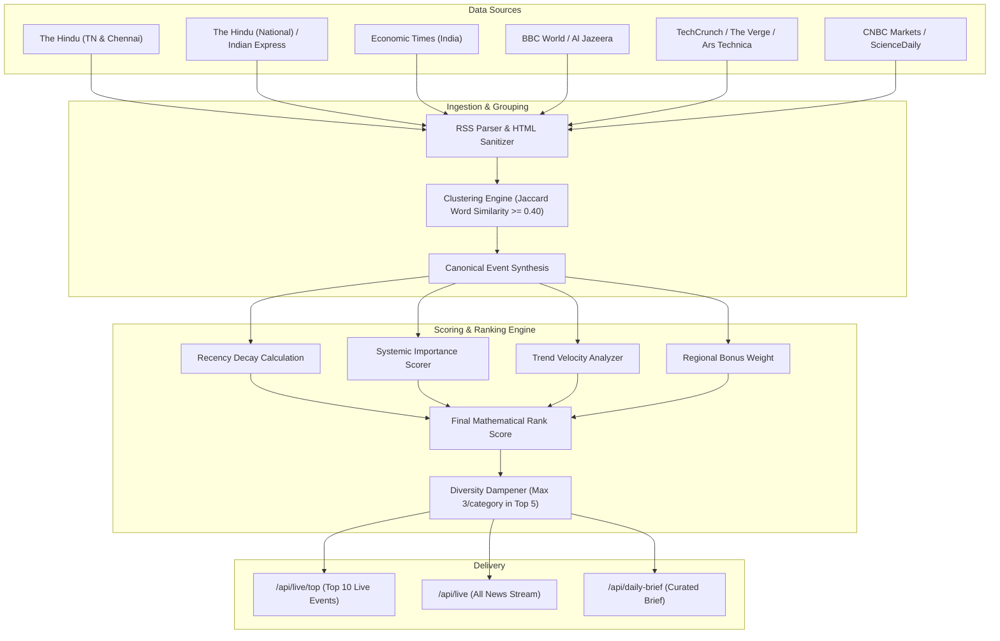
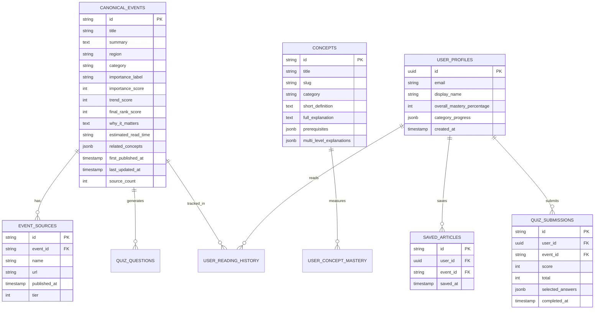
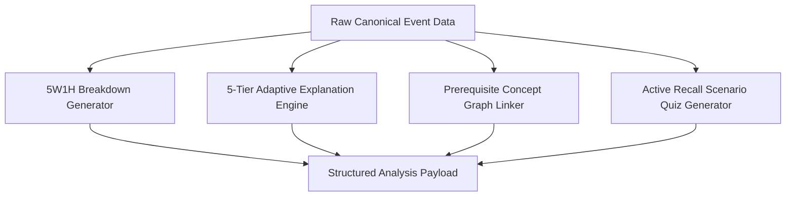

# AKIRA — PHASE 0: SYSTEM ARCHITECTURE & TECHNICAL SPECIFICATION

```
PHASE 0
│
├── User Journey
│   ├── 6-Stage Cognitive Knowledge Loop
│   ├── Application Page Routing & Interaction Flows
│   └── User State & Session Management
│
├── Live & Trending Architecture
│   ├── Data sources (Tier 1 & Tier 2 Wire Feeds)
│   ├── Update frequency (Cron Polling, Client Streaming & Sync)
│   ├── Event grouping (Clustering, Deduplication & Hashing)
│   ├── Trend detection (Multi-Source Corroboration Velocity)
│   └── Top 10 ranking (Mathematical Scoring & Diversity Dampening)
│
├── Regional Strategy
│   ├── Tamil Nadu (First-Class State Coverage & Lexicon)
│   ├── India (National Policy, Macro Economy & Infrastructure)
│   └── World (Global Geopolitics, AI Regulation & Global Markets)
│
├── Database
│   ├── PostgreSQL 15+ Relational Entity Schema
│   ├── Supabase DDL, Foreign Keys & Constraints
│   └── Indexing Strategy & Row-Level Security (RLS)
│
├── APIs
│   ├── RESTful Endpoints Contract & Aliasing
│   ├── Input/Output JSON Schemas
│   └── Centralized Error Handling & HTTP Status Matrix
│
├── AI Architecture
│   ├── 5W1H Atomic Structured Breakdown Engine
│   ├── 5-Tier Adaptive Explanation Ladder (ELI5 to Deep Dive)
│   ├── Dynamic Prerequisite Concept Graph Extraction
│   └── Scenario-Based Active Recall Quiz Engine
│
└── Development Roadmap
    ├── Phase 0: Foundations & Live Wire Ingestion (Complete)
    ├── Phase 1: Accounts, Persistence & Spaced Repetition (Current)
    ├── Phase 2: Semantic Vector Embeddings & Graph Visualization
    └── Phase 3: Mobile Native & 2-Minute Audio Briefings
```

---

## 1. 🧭 User Journey

AKIRA transforms overwhelming, unstructured, and sensationalized news into an active, continuous knowledge acquisition cycle:

$$\textbf{DISCOVER} \longrightarrow \textbf{UNDERSTAND} \longrightarrow \textbf{LEARN} \longrightarrow \textbf{TEST} \longrightarrow \textbf{REMEMBER} \longrightarrow \textbf{PERSONALIZE}$$



### 1.1. The 6-Stage Cognitive Knowledge Loop
1. **DISCOVER (Dashboard & Real-Time Intelligence Stream):**
   - User arrives at the **Dashboard** (`/`) or **Live & Trending** (`/live`) or **All News Stream** (`/all-news`).
   - The user sees live counters (150+ verified events), dynamic urgency badges (`BREAKING`, `TRENDING`, `IMPORTANT`), and importance scores ($0-100$).
   - Multi-criteria instant filtering allows filtering by **Region** (Tamil Nadu, India, World) and **Category** (AI & Tech, Economy, Cybersecurity, Science, Government).
2. **UNDERSTAND (Event Detail & 5W1H Breakdown):**
   - User clicks any event to open the comprehensive intelligence brief (`/event/:id`).
   - Eliminating paywalled prose and political bias, the user receives an atomic **5W1H Breakdown**:
     - *What happened?* (Core factual development)
     - *Why did it happen?* (Underlying drivers and converging catalysts)
     - *Why does it matter?* (Direct real-world consequences)
     - *Who is affected?* (Citizens, industries, institutions, and consumers)
     - *What could happen next?* (Near-term milestones and expected outcomes)
     - *Historical Background & Context* (Past precedents)
     - *Corroborating Multi-Source Links* (Reuters, BBC, The Hindu, TechCrunch, etc.)
3. **LEARN (5-Level Adaptive Explanations & Prerequisites):**
   - User toggles the **Adaptive Difficulty Ladder**:
     - **Very Simple (ELI5):** Metaphors for beginners, $\le 2$ sentences.
     - **Beginner:** Clean, foundational summary with zero jargon.
     - **Student:** Systemic cause-and-effect relationships and mechanisms.
     - **Technical:** Domain terminology, operational dependencies, and compliance.
     - **Deep Dive:** Macroeconomic equilibria, strategic incentives, and second-order impacts.
   - Embedded **Prerequisite Concept Badges** (e.g., *Monetary Policy*, *Zero-Day Exploits*, *AI Governance*) let users branch into core concepts before continuing.
4. **TEST (Interactive 3-Question Active Recall Quiz):**
   - Immediate scenario-based application testing.
   - Evaluates real comprehension (not rote trivia) with detailed rationale for correct answers and distractor explanations.
5. **REMEMBER (My Library & Spaced Review):**
   - Bookmarks articles to **My Library** (`/library`).
   - Completed concepts are indexed with mastery timestamps for periodic review.
6. **PERSONALIZE (My Knowledge Profile):**
   - Visualizes category mastery percentages across domains on **My Knowledge** (`/knowledge`), highlighting strong areas and recommending prerequisite paths.

### 1.2. Application Page Routing & Interaction Map

| Route Path | View Component | Core Functionality |
|---|---|---|
| `/` | `Dashboard.tsx` | Daily greeting, spotlight must-know story, high-impact breaking briefs, category mastery overview |
| `/live` | `LiveTrendingPage.tsx` | Top 10 dynamic ranked events with region tabs (Tamil Nadu, India, World) and diversity dampening |
| `/all-news` | `AllNewsPage.tsx` | Full 150+ live article wire stream with instant search, category filters, and manual sync button |
| `/daily-brief` | `DailyBriefPage.tsx` | Curated daily briefing featuring top 6 high-impact developments of the day |
| `/event/:id` | `EventDetailPage.tsx` | Comprehensive 5W1H breakdown, 5-tier adaptive explanations, concepts, and 3-question quiz |
| `/learn` | `LearnPage.tsx` | Interactive prerequisite concept library with multi-level definitions and key takeaways |
| `/knowledge` | `KnowledgePage.tsx` | Knowledge profile radar, category progress bars, weak/strong areas, and assessment quizzes |
| `/library` | `LibraryPage.tsx` | Saved articles, read history, and bookmarked learning paths |
| `/category/:slug` | `CategoryPage.tsx` | Domain-specific stream filtered dynamically by category (e.g., `ai-technology`, `economy-money`) |
| `/search` | `SearchPage.tsx` | Full-text keyword and concept search over live ingested feeds |
| `/profile` | `ProfilePage.tsx` | User profile settings and learning preferences |

---

## 2. ⚡ Live & Trending Architecture

The Live & Trending engine handles high-throughput RSS polling, HTML sanitization, multi-source clustering, trend velocity computation, and diversity-dampened ranking.



### 2.1. Data Sources
The engine continuously consumes from 13 verified, high-credibility wire feeds:

| Domain | Source Name | Feed URL | Region | Tier |
|---|---|---|---|---|
| **Tamil Nadu** | The Hindu (Tamil Nadu) | `thehindu.com/news/national/tamil-nadu/feeder/default.rss` | Tamil Nadu | 1 |
| **Tamil Nadu** | The Hindu (Chennai) | `thehindu.com/news/cities/chennai/feeder/default.rss` | Tamil Nadu | 1 |
| **India** | The Hindu (National) | `thehindu.com/news/national/feeder/default.rss` | India | 1 |
| **India** | Indian Express | `indianexpress.com/section/india/feed/` | India | 1 |
| **Economy** | Economic Times | `economictimes.indiatimes.com/rssfeedstopstories.cms` | India | 1 |
| **World** | BBC World | `feeds.bbci.co.uk/news/world/rss.xml` | World | 1 |
| **World** | Al Jazeera | `aljazeera.com/xml/rss/all.xml` | World | 1 |
| **AI & Tech** | TechCrunch | `techcrunch.com/feed/` | World | 1 |
| **AI & Tech** | The Verge | `theverge.com/rss/index.xml` | World | 1 |
| **AI & Tech** | Ars Technica | `feeds.arstechnica.com/arstechnica/index` | World | 2 |
| **Markets** | CNBC Markets | `search.cnbc.com/rs/search/combinedcms/view.xml` | World | 1 |
| **Science** | ScienceDaily | `sciencedaily.com/rss/top/science.xml` | World | 1 |
| **Cybersecurity** | BleepingComputer | `bleepingcomputer.com/feed/` | World | 1 |

### 2.2. Update Frequency & Sync Cycles
- **Server Background Polling:** Automated 3-minute cron loop running inside `NewsIngestionService` pulls delta updates asynchronously.
- **Client Auto-Refresh:** Frontend streams poll `/api/live` every **60 seconds** to reflect incoming updates seamlessly.
- **On-Demand Manual Sync:** When users or admins trigger **"Fetch Latest News"**, an immediate async sync executes via `POST /api/live/sync`, returning the count of newly ingested events and total active pool size.

### 2.3. Event Grouping (Clustering, Deduplication & Hashing)
To prevent duplicate headlines when multiple publications report on the same event:
1. **Tokenization & Stopword Stripping:** The incoming article title and summary are normalized to lowercase alphanumeric tokens $\ge 4$ characters.
2. **Jaccard Word Similarity:** The incoming token set $A$ is compared against active canonical event token sets $B$ within an 18-hour sliding window:
   $$J(A, B) = \frac{|A \cap B|}{|A \cup B|}$$
3. **Corroboration Attachment:** If $J(A, B) \ge 0.40$, the incoming report is merged into the existing **Canonical Event** as a corroborated source in `sources[]`.
4. **Canonical ID Hashing:** If no match exists, a deterministic bitwise 32-bit hash is generated:
   $$\text{hash} = (\text{hash} \ll 5) - \text{hash} + \text{charCode}(c_i)$$
   yielding unique, clean identifiers like `event-tn-1`, `event-9f8z2x`.

### 2.4. Trend Detection
Trend velocity evaluates corroboration breadth and recency:
$$\text{Trend Score } (T) = \min\left(100, \text{sourceCount} \times 25 + \text{FreshnessBonus}\right)$$
- $\text{FreshnessBonus} = +30$ if published $< 4\text{ hours ago}$
- $\text{FreshnessBonus} = +15$ if published $< 8\text{ hours ago}$

### 2.5. Top 10 Ranking Engine & Diversity Dampener
Every event receives a composite mathematical rank score:

$$\text{Final Rank Score} = 0.30 \cdot R + 0.30 \cdot I + 0.25 \cdot T + G$$

Where:
- **$R$ (Exponential Recency Decay):**
  $$R = \max\left(10, \min\left(100, \text{round}\left(100 \cdot e^{-0.08 \cdot \text{hoursAgo}}\right)\right)\right)$$
- **$I$ (Systemic Importance Score):** Base 45, boosted up to 98 based on structural keywords:
  - Monetary policy / Inflation / Repo rate: $+30$
  - Zero-day exploit / Cyber breach: $+28$
  - AI Act / Semiconductor lithography: $+25$
  - Public infrastructure / Government scheme: $+25$
  - Treaties / Sanctions / Geopolitics: $+22$
- **$T$ (Trend Score):** Multi-source corroboration score ($0-100$).
- **$G$ (Regional Boost Weight):**
  - Tamil Nadu: $+25$
  - India: $+20$
  - World: $+15$

**Diversity Dampening Algorithm:**
To prevent a single trending category (e.g. 5 consecutive tech articles) from monopolizing the stream, no single category or region may take more than **3 slots in the Top 5**.

---

## 3. 🌏 Regional Strategy

AKIRA treats local, national, and global intelligence as interconnected layers:

```
┌────────────────────────────────────────────────────────┐
│ 🌍 WORLD (Global Geopolitics, AI Regulation, Markets)   │
│   ▲                                                    │
│   │                                                    │
│ 🇮🇳 INDIA (Union Policy, RBI, Parliament, ISRO, UPI)    │
│   ▲                                                    │
│   │                                                    │
│ 🇮🇳 TAMIL NADU (State Corridors, CMRL, EV, DIPR)       │
└────────────────────────────────────────────────────────┘
```

### 3.1. 🇮🇳 Tamil Nadu (First-Class State Coverage)
- **Regional Lexicon:** `tamil nadu`, `chennai`, `coimbatore`, `madurai`, `trichy`, `salem`, `tirunelveli`, `stalin`, `cmrl`, `tangedco`, `anna university`, `madras`.
- **Focus Areas:** State government policy, DIPR press releases, Chennai Metro Phase 2 corridors, Hosur/Coimbatore EV industrial corridors, TANGEDCO green energy, agricultural water management, and state welfare schemes.
- **Regional Weight:** $+25$ priority bonus.

### 3.2. 🇮🇳 India (National Intelligence)
- **Regional Lexicon:** `india`, `delhi`, `mumbai`, `bengaluru`, `hyderabad`, `parliament`, `supreme court of india`, `rbi`, `isro`, `modi`, `loksabha`, `rajyasabha`, `upi`, `rupee`.
- **Focus Areas:** Union Cabinet decisions, Reserve Bank of India (RBI) repo rate & monetary policy, Supreme Court landmark verdicts, ISRO space exploration, digital public infrastructure (UPI, ONDC), macro budget & inflation metrics.
- **Regional Weight:** $+20$ priority bonus.

### 3.3. 🌍 World (Global Intelligence)
- **Focus Areas:** Geopolitics, international trade agreements, European Union AI Act & frontier model safety, global semiconductor manufacturing supply chains, enterprise zero-day cybersecurity vectors, and climate science.
- **Regional Weight:** $+15$ priority bonus.

---

## 4. 🗄️ Database Architecture

The data tier is structured for PostgreSQL 15+ / Supabase with Row-Level Security (RLS) and strict typing:



### 4.1. Core PostgreSQL DDL Schemas

```sql
-- 1. Canonical Events Table
CREATE TABLE IF NOT EXISTS canonical_events (
    id VARCHAR(64) PRIMARY KEY,
    title TEXT NOT NULL,
    summary TEXT NOT NULL,
    region VARCHAR(32) NOT NULL CHECK (region IN ('Tamil Nadu', 'India', 'World')),
    category VARCHAR(64) NOT NULL,
    importance_label VARCHAR(16) NOT NULL CHECK (importance_label IN ('BREAKING', 'TRENDING', 'IMPORTANT')),
    importance_score INTEGER NOT NULL CHECK (importance_score BETWEEN 0 AND 100),
    trend_score INTEGER NOT NULL CHECK (trend_score BETWEEN 0 AND 100),
    final_rank_score INTEGER NOT NULL,
    why_it_matters TEXT,
    estimated_read_time VARCHAR(32) NOT NULL DEFAULT '3 min read',
    related_concepts JSONB DEFAULT '[]'::jsonb,
    first_published_at TIMESTAMPTZ NOT NULL,
    last_updated_at TIMESTAMPTZ NOT NULL,
    source_count INTEGER NOT NULL DEFAULT 1
);

-- 2. Corroborating Event Sources Table
CREATE TABLE IF NOT EXISTS event_sources (
    id UUID PRIMARY KEY DEFAULT gen_random_uuid(),
    event_id VARCHAR(64) REFERENCES canonical_events(id) ON DELETE CASCADE,
    name VARCHAR(128) NOT NULL,
    url TEXT NOT NULL,
    published_at TIMESTAMPTZ NOT NULL,
    tier INTEGER NOT NULL DEFAULT 1
);

-- 3. Foundational Concepts Table
CREATE TABLE IF NOT EXISTS concepts (
    id VARCHAR(64) PRIMARY KEY,
    title VARCHAR(128) NOT NULL,
    slug VARCHAR(128) UNIQUE NOT NULL,
    category VARCHAR(64) NOT NULL,
    short_definition TEXT NOT NULL,
    full_explanation TEXT NOT NULL,
    prerequisites JSONB DEFAULT '[]'::jsonb,
    multi_level_explanations JSONB NOT NULL
);

-- 4. User Profiles & Knowledge Progress
CREATE TABLE IF NOT EXISTS user_profiles (
    id UUID PRIMARY KEY REFERENCES auth.users(id) ON DELETE CASCADE,
    email VARCHAR(255) NOT NULL,
    display_name VARCHAR(128),
    overall_mastery_percentage INTEGER DEFAULT 0,
    category_progress JSONB DEFAULT '[]'::jsonb,
    created_at TIMESTAMPTZ DEFAULT NOW()
);

-- 5. Quiz Submissions & Spaced Repetition Tracking
CREATE TABLE IF NOT EXISTS quiz_submissions (
    id UUID PRIMARY KEY DEFAULT gen_random_uuid(),
    user_id UUID REFERENCES user_profiles(id) ON DELETE CASCADE,
    event_id VARCHAR(64) REFERENCES canonical_events(id) ON DELETE CASCADE,
    score INTEGER NOT NULL,
    total INTEGER NOT NULL,
    selected_answers JSONB NOT NULL,
    completed_at TIMESTAMPTZ DEFAULT NOW()
);

-- Indexes for performance
CREATE INDEX IF NOT EXISTS idx_events_rank ON canonical_events(final_rank_score DESC);
CREATE INDEX IF NOT EXISTS idx_events_region ON canonical_events(region);
CREATE INDEX IF NOT EXISTS idx_events_pub ON canonical_events(last_updated_at DESC);
CREATE INDEX IF NOT EXISTS idx_events_concepts ON canonical_events USING GIN (related_concepts);
```

---

## 5. 🔌 RESTful APIs Contract

Base URL: `/api` (Proxied via Vite in dev; directly accessible on Express port 5000):

| Method | Endpoint Path | Description | Query / Body Params | Response Status & Shape |
|---|---|---|---|---|
| `GET` | `/live` | Full live wire stream with filters | `region`, `category`, `label`, `search`, `limit` | `200 OK` `{ success: true, data: CanonicalEvent[], meta: { total, lastSyncTime, isSyncing } }` |
| `GET` | `/live/top` | Top 10 dynamic ranked events | `region` (`Tamil Nadu`, `India`, `World`, `ALL`) | `200 OK` `{ success: true, data: CanonicalEvent[10], meta: { count, regionFilter } }` |
| `POST` | `/live/sync` | Trigger multi-source RSS ingestion | None | `200 OK` `{ success: true, message: string, data: { newCount, totalEvents } }` |
| `GET` | `/daily-brief` | Curated daily briefing (Top 6 stories) | None | `200 OK` `{ success: true, data: CanonicalEvent[6], meta: { curatedCount } }` |
| `GET` | `/events/:id` | Full 5W1H breakdown, 5 explanations, quiz | Route param: `:id` | `200 OK` `{ success: true, data: DetailedEventWithAnalysis }` / `404 Not Found` |
| `GET` | `/concepts` | Foundational concept library | `category`, `slug` | `200 OK` `{ success: true, data: Concept[] }` |
| `POST` | `/quiz/submit` | Submit quiz responses & compute score | Body: `{ eventId, answers: number[] }` | `200 OK` `{ success: true, data: { score, total, percentage, explanations } }` |
| `GET` | `/health` | API service health check | None | `200 OK` `{ status: "healthy", service: "AKIRA", timestamp }` |

*(All endpoints support backward-compatible aliases: `/news/live`, `/news/sync`, `/articles/:id`, `/news/:id`).*

---

## 6. 🤖 AI Architecture

The AI Explainer pipeline transforms unstructured breaking news into an active, multi-layered comprehension experience:



### 6.1. 5W1H Atomic Structured Breakdown Engine
Transforms noisy reports into 6 standardized fields:
- **What Happened:** Concise, verified summary of the core development.
- **Why Did It Happen:** Structural factors, administrative announcements, and strategic shifts.
- **Why Does It Matter:** Direct impact on policy execution, commercial operations, and institutional standards.
- **Who Is Affected:** Citizens, practitioners, enterprises, policymakers, and end consumers.
- **What Could Happen Next:** Near-term operational guidelines, review milestones, and policy rollouts.
- **Historical Background:** Contextual precedent enabling deeper understanding.

### 6.2. 5-Tier Adaptive Difficulty Ladder
1. **Very Simple (ELI5):** Max 2 sentences using intuitive everyday metaphors.
2. **Beginner:** Fundamental summary with accessible language.
3. **Student:** Academic breakdown focusing on systemic relationships, incentives, and variables.
4. **Technical:** Architectural dependencies, statutory compliance guidelines, and domain frameworks.
5. **Deep Dive:** Macroeconomic equilibria, second-order incentives, and long-term institutional shifts.

### 6.3. Dynamic Prerequisite Concept Graph Linker
- Scans event content for foundational domain mechanisms.
- Links events to interactive concept trees (e.g. *Monetary Policy*, *Semiconductor Lithography*, *Zero-Day Vulnerabilities*, *Public Infrastructure*).

### 6.4. Scenario-Based Active Recall Quiz Engine
- Generates 3 contextual scenario questions per event.
- Includes clear explanations for why the correct option is right and breaks down why distractors are inaccurate.

---

## 7. 🚀 Development Roadmap

```
PHASE 0 (Complete) ──► PHASE 1 (In Progress) ──► PHASE 2 (Planned) ──► PHASE 3 (Future)
```

### ✅ Phase 0: Foundations & Live Intelligence Stream (COMPLETED)
- [x] Multi-source RSS ingestion engine across Tamil Nadu, India, World, Tech, and Economy feeds.
- [x] Canonical event clustering ($J \ge 0.40$), deduplication hashing, and trend velocity scoring.
- [x] Deterministic Top 10 ranking engine with diversity dampening.
- [x] 5W1H structured breakdowns and 5-tier adaptive explanation engine.
- [x] Live client streaming UI with instant search, regional tabs, category pills, and manual sync trigger.
- [x] Route aliasing, Vite dev proxy, and build validation.

### ⏳ Phase 1: User Accounts, Persistence & Spaced Repetition (CURRENT)
- [ ] Supabase Auth (Magic Link, Google OAuth) integration.
- [ ] SuperMemo (SM-2) spaced repetition algorithm for periodic active recall review intervals.
- [ ] Persistent User Knowledge Profile tracking category mastery.
- [ ] My Library article bookmarking and offline persistence.

### 🔮 Phase 2: Semantic Vector Graph (PLANNED)
- [ ] `pgvector` embedding storage for semantic similarity search.
- [ ] Interactive 3D/2D Knowledge Graph connecting events to prerequisite concepts.
- [ ] Automated LLM distillation pipeline via Google Gemini API.

### 🌟 Phase 3: Mobile Native & Audio Intelligence (FUTURE)
- [ ] React Native cross-platform mobile client (iOS & Android).
- [ ] 2-Minute Daily Audio Briefing generator (Text-to-Speech).
- [ ] Push notification alert wire for Breaking & High-Impact events.
