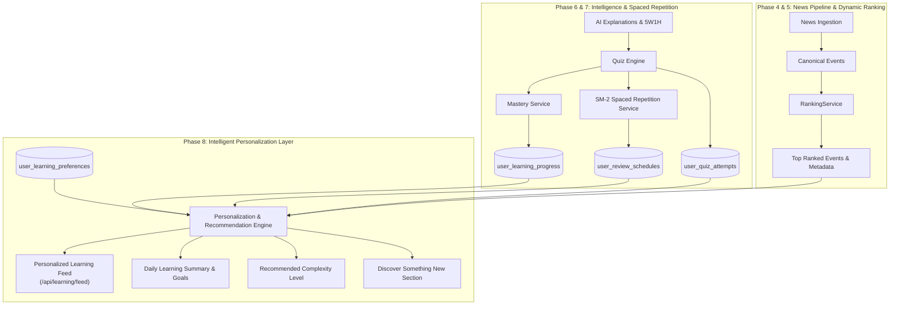

# 🧠 AKIRA — Phase 8 Implementation Plan: Intelligent Daily Learning & Adaptive Personalization

## 1. Executive Overview & Phase Objectives
Phase 8 transforms AKIRA from a static news-to-quiz learning engine into an **adaptive, intelligent, continuous learning platform**:
$$\text{News} \longrightarrow \text{Personalized Discovery} \longrightarrow \text{Understanding} \longrightarrow \text{Quiz} \longrightarrow \text{Mastery} \longrightarrow \text{Spaced Review} \longrightarrow \text{Continuous Learning}$$

### Core Tenets of Phase 8:
1. **100% Deterministic & Explainable**: No opaque black-box machine-learning or LLM-based recommendation models. Every recommendation derives from explicit mathematical formulas, verified database signals, and deterministic rules.
2. **Real Behavioral Signals**: Personalization is computed from real quiz attempts, mastery scores, SM-2 review dates, and user activity records. Zero synthetic metrics.
3. **Strict Phase Isolation & Reuse**: Reuses Phase 4 (Ingestion/Clustering), Phase 5 (Top 10 Ranking & Trend Detection), Phase 6 (5W1H & Adaptive Explanations), and Phase 7 (Mastery & SM-2 Spaced Repetition).
4. **Anti-Filter-Bubble Exploration**: Deterministically reserves $15\text{--}25\%$ of the feed for exploration outside the user's top categories.
5. **Multi-Tenant Security & Privacy**: User profile isolation, session-derived identity, no client score tampering, and zero inference of sensitive personal or political preferences.

---

## 2. Existing Architecture & Integration Points

### Phase 5 Integration Points:
- **`RankingService.scoreEvent`**: Provides `finalRankScore`, `importanceScore`, `trendScore`, `velocityScore`, `recencyScore`, `freshnessScore`, and `regionalRelevanceScore`.
- **Canonical Event Pool**: Candidate events are queried from `EventRepository` and scored using Phase 5 ranking logic.

### Phase 6 Integration Points:
- **`aiService.getConcepts(eventId)`**: Concept extraction and prerequisite graph nodes.
- **Adaptive Explanations (5 levels)**: Phase 8 computes a recommended explanation level (`verySimple`, `beginner`, `student`, `technical`, `deepDive`) based on user mastery in related concepts, while preserving full manual user override.

### Phase 7 Integration Points:
- **`learningRepository.getAllProgressForUser(userId)`**: Concept mastery scores and statuses (`NEEDS_LEARNING`, `DEVELOPING`, `STRONG`).
- **`learningRepository.getAllSchedulesForUser(userId)`**: SM-2 spaced repetition state (`nextReviewAt`, `intervalDays`, `repetitionCount`, `easeFactor`).
- **`learningRepository.getAttemptsForUser(userId)`**: Historical quiz submissions for category affinity and streak calculations.
- **`learningRepository.getActivitiesForUser(userId)`**: Learning event stream (`EVENT_VIEWED`, `EXPLANATION_VIEWED`, `QUIZ_COMPLETED`, `EVENT_SAVED`).

---

## 3. Phase 8 Architecture & Deterministic Scoring Algorithm

### 3.1 The Personalization Scoring Formula
For each candidate canonical event $e$, the composite `PersonalizedScore` ($0\text{--}100$) is computed deterministically:

$$\text{PersonalizedScore}(e) = \left( 0.25 \times G(e) + 0.25 \times K(e) + 0.20 \times R(e) + 0.15 \times C(e) + 0.10 \times F(e) + 0.05 \times E(e) \right)$$

Where all sub-scores are normalized to the range $[0, 100]$:

1. **Global News Score $G(e)$**:
   $$G(e) = \text{event.finalRankScore} \quad (\text{from Phase 5})$$
   Ensures globally critical and breaking news maintains high baseline learning visibility.

2. **Knowledge Gap Score $K(e)$**:
   Evaluated across all concepts associated with event $e$:
   - For an event with concepts $C_1, C_2, \dots, C_n$:
     - If user has no record for concept $C_i$: Gap score = $70$ (unfamiliar topic).
     - If user mastery is `NEEDS_LEARNING` ($M < 50$): Gap score = $100 - M$ (high learning priority, e.g. $M=20 \to 80$).
     - If user mastery is `DEVELOPING` ($50 \le M < 80$): Gap score = $100 - M$ (medium priority, e.g. $M=65 \to 35$).
     - If user mastery is `STRONG` ($M \ge 80$): Gap score = $\max(10, 100 - M)$ (low gap, e.g. $M=90 \to 10$).
   - $K(e) = \frac{1}{n} \sum_{i=1}^n \text{Gap}(C_i)$. If event has no concepts linked, $K(e) = 50$.

3. **Review Priority Score $R(e)$**:
   Computed from Phase 7 SM-2 review schedule for event $e$:
   - If no review schedule exists for $e$: $R(e) = 0$.
   - If review is scheduled in future ($\text{nextReviewAt} > \text{now}$): $R(e) = 10$.
   - If review is due today ($\text{nextReviewAt} \le \text{now}$):
     $$R(e) = \min\left(100, 70 + \min(20, \text{overdueHours} \times 2) + \max(0, 10 - \text{mastery}/10)\right)$$
   - Overdue reviews are prioritized but capped at 100 so they do not permanently starve new content.

4. **Category Affinity Score $C(e)$**:
   Computed from user's real interaction history across categories:
   $$\text{Affinity}(\text{cat}) = \frac{\text{Interactions in cat}}{\text{Total user interactions}} \times 100$$
   - Interactions include: Quiz attempts ($3\times$ weight), Saved events ($2\times$ weight), Viewed events ($1\times$ weight).
   - If user is new (zero interactions), $C(e) = 50$ for all categories.
   - For existing users, $C(e) = \min(100, \text{Affinity}(e.\text{category}))$.

5. **Freshness Score $F(e)$**:
   $$F(e) = \text{event.rankingMetadata.freshnessScore} \quad (\text{from Phase 5})$$
   Step-wise decay: $<1\text{h}=100$, $1\text{--}3\text{h}=75$, $3\text{--}6\text{h}=50$, $6\text{--}12\text{h}=25$, $>12\text{h}=0$.

6. **Exploration Score $E(e)$**:
   Boosts high-quality canonical events in categories where the user has low affinity ($< 15\%$ of interactions) or zero concept attempts:
   - If user interaction in category is $0$: $E(e) = 100$.
   - If user interaction in category is $< 10\%$: $E(e) = 75$.
   - If user interaction is $> 30\%$: $E(e) = 10$.

### 3.2 Feed Composition & Exploration Guarantee (80/20 Rule)
To prevent creating a filter bubble:
- **Personalized Relevance Slots ($80\%$)**: Top scoring events ranked by `PersonalizedScore`.
- **Exploration Slots ($20\%$)**: Top globally ranked events from unexplored or low-affinity categories with high importance ($G(e) \ge 75$).
- **Diversity Rules**:
  - Maximum 3 events per category in the top 10.
  - Maximum 4 events per region tier in the top 10.
  - Zero duplicate canonical events.

### 3.3 Deterministic Recommendation Reason Assignment
Every item in the feed receives an explicit, human-readable reason derived from the highest contributing scoring component:
| Dominant Signal | Reason Code | User Explanation | Badge Label |
|---|---|---|---|
| Review Due ($R(e) \ge 70$) | `REVIEW_DUE` | "Scheduled active recall review is due today to reinforce retention." | `REVIEW DUE` |
| High Knowledge Gap ($K(e) \ge 60$) | `WEAK_CONCEPT` | "Related to concepts where your current mastery is developing." | `STRENGTHEN` |
| Category Affinity ($C(e) \ge 60$) | `CATEGORY_AFFINITY` | "Matches your active interest in {category}." | `FOR YOU` |
| Exploration ($E(e) \ge 75$) | `EXPLORATION` | "Broaden your domain knowledge with important developments outside your usual topics." | `DISCOVER NEW` |
| Global Breaking ($G(e) \ge 90 \land F(e) \ge 75$) | `BREAKING_GLOBAL` | "High-impact developing event verified across multiple sources." | `BREAKING` |
| In Progress Developing | `CONTINUE_LEARNING` | "Continue advancing your mastery on this active subject." | `CONTINUE` |

---

## 4. Proposed Changes

### 4.1 Database Layer & Migrations

#### [NEW] [`server/src/db/migrations/007_phase8_adaptive_personalization.sql`](file:///a:/My%20web%20app%28ML%20ai%29/server/src/db/migrations/007_phase8_adaptive_personalization.sql)
- Creates `public.user_learning_preferences`:
  - `id UUID PRIMARY KEY DEFAULT gen_random_uuid()`
  - `user_id UUID NOT NULL REFERENCES auth.users(id) ON DELETE CASCADE UNIQUE`
  - `daily_goal INT NOT NULL DEFAULT 3 CHECK (daily_goal BETWEEN 1 AND 20)`
  - `preferred_difficulty VARCHAR(30) NOT NULL DEFAULT 'ADAPTIVE'`
  - `created_at TIMESTAMPTZ NOT NULL DEFAULT NOW()`
  - `updated_at TIMESTAMPTZ NOT NULL DEFAULT NOW()`
- Adds missing performance indexes on `user_learning_activities(user_id, activity_type, created_at DESC)`.

#### [MODIFY] [`server/src/db/dbClient.ts`](file:///a:/My%20web%20app%28ML%20ai%29/server/src/db/dbClient.ts)
- Adds DDL auto-creation for `user_learning_preferences` on PostgreSQL startup.

---

### 4.2 Server Services & Repositories

#### [NEW] [`server/src/services/learning/personalization.service.ts`](file:///a:/My%20web%20app%28ML%20ai%29/server/src/services/learning/personalization.service.ts)
- Implements:
  - `calculatePersonalizedFeed(userId: string, options: PersonalizationFeedOptions): Promise<PersonalizedFeedResult>`
  - `calculateCategoryAffinities(attempts, activities, saved): Map<string, number>`
  - `calculateKnowledgeGap(event, userProgressMap): { gapScore: number; weakConcepts: string[] }`
  - `calculateReviewPriority(event, userScheduleMap): number`
  - `getDailyLearningSummary(userId: string): Promise<DailyLearningSummary>`
  - `getUserPreferences(userId: string): Promise<UserLearningPreferences>`
  - `updateUserPreferences(userId: string, updates: Partial<UserLearningPreferences>): Promise<UserLearningPreferences>`

#### [MODIFY] [`server/src/repositories/learning.repository.ts`](file:///a:/My%20web%20app%28ML%20ai%29/server/src/repositories/learning.repository.ts)
- Adds preferences persistence methods (`getPreferences(userId)`, `savePreferences(prefs)`).
- Adds query helpers for daily activities count and category aggregation.

#### [MODIFY] [`server/src/types/index.ts`](file:///a:/My%20web%20app%28ML%20ai%29/server/src/types/index.ts)
- Adds Phase 8 types: `PersonalizedFeedItem`, `PersonalizedFeedResult`, `RecommendationReasonCode`, `DailyLearningSummary`, `UserLearningPreferences`.

---

### 4.3 REST API & Controllers

#### [NEW] [`server/src/controllers/personalization.controller.ts`](file:///a:/My%20web%20app%28ML%20ai%29/server/src/controllers/personalization.controller.ts)
- Endpoints:
  - `GET /api/learning/feed`: Returns personalized discovery feed (paginated, with reasons and context).
  - `GET /api/learning/daily-summary`: Returns today's activity stats, streak, reviews due, and daily goal progress.
  - `GET /api/learning/preferences`: Returns user learning preferences.
  - `PUT /api/learning/preferences`: Updates daily goal or preferences with validation.
  - `POST /api/learning/activity`: Lightweight tracking endpoint for `EVENT_VIEWED`, `EXPLANATION_VIEWED`.

#### [MODIFY] [`server/src/routes/learning.routes.ts`](file:///a:/My%20web%20app%28ML%20ai%29/server/src/routes/learning.routes.ts)
- Mounts `/feed`, `/daily-summary`, `/preferences`, and `/activity` routes protected with `requireAuth` and rate limiting.

#### [MODIFY] [`server/src/tests/phase5.test.ts`](file:///a:/My%20web%20app%28ML%20ai%29/server/src/tests/phase5.test.ts) & [`server/src/tests/phase7.test.ts`](file:///a:/My%20web%20app%28ML%20ai%29/server/src/tests/phase7.test.ts)
- Fix timestamp relative date calculations in test fixtures so regression suite executes 100% green on all calendar dates.

---

### 4.4 Frontend Components & Pages

#### [NEW] [`client/src/components/cards/PersonalizedEventCard.tsx`](file:///a:/My%20web%20app%28ML%20ai%29/client/src/components/cards/PersonalizedEventCard.tsx)
- Visual card showing:
  - Recommendation Reason Badge (`REVIEW DUE`, `STRENGTHEN`, `FOR YOU`, `DISCOVER NEW`, `BREAKING`).
  - Contextual explanation line (e.g. *"Matches your interest in Economy"* or *"Concepts need strengthening"*).
  - Recommended complexity level indicator.
  - Quick action buttons ("Read & Learn", "Take Quiz", "Review").

#### [MODIFY] [`client/src/services/learningService.ts`](file:///a:/My%20web%20app%28ML%20ai%29/client/src/services/learningService.ts)
- Adds API methods: `getPersonalizedFeed()`, `getDailySummary()`, `getPreferences()`, `updatePreferences()`, `trackActivity()`.

#### [MODIFY] [`client/src/pages/LearnPage.tsx`](file:///a:/My%20web%20app%28ML%20ai%29/client/src/pages/LearnPage.tsx)
- Reorganizes into structured Phase 8 dashboard:
  - **Section 1: Today's Learning & Daily Target Progress** (Activities completed vs daily goal of 3).
  - **Section 2: Due Reviews Queue** (SM-2 Spaced Repetition items).
  - **Section 3: Continue Learning Pathway** (In-progress & weak concepts).
  - **Section 4: Personalized For You Learning Feed** (Deterministic scored feed with reason tags).
  - **Section 5: Discover Something New** (Exploration section showing novel domains).
  - **Section 6: Knowledge Domain Category Progress**.

#### [MODIFY] [`client/src/pages/EventDetailPage.tsx`](file:///a:/My%20web%20app%28ML%20ai%29/client/src/pages/EventDetailPage.tsx)
- Displays "Why You're Seeing This" context banner.
- Displays recommended adaptive explanation level pill based on user mastery.
- Automatically tracks `EVENT_VIEWED` and `EXPLANATION_VIEWED` activities.

---

## 5. Security & Privacy Review
- **Authentication**: JWT token strictly validated via `requireAuth`.
- **Tenant Isolation**: All queries strictly enforce `WHERE user_id = req.user.id`. Client-provided `userId` parameters are rejected.
- **Client Tampering Protection**: Client cannot submit or alter personalized scores, mastery statuses, review intervals, or recommendation reasons.
- **Privacy & Political Neutrality**:
  - No inference of sensitive user traits (political ideology, voting record, religion, health).
  - Personalization operates purely on content categories (e.g., `technology`, `economy`, `infrastructure`) and learning performance.

---

## 6. Verification & Testing Strategy

### 6.1 Phase 8 Automated Test Suite (`server/src/tests/phase8.test.ts`)
Creates a comprehensive 20+ test suite verifying:
1. **Personalized Feed Logic**: Returns valid ranked events with deterministic score ordering.
2. **Limit & Pagination**: Correctly slices feeds.
3. **Determinism**: Identical user inputs produce identical scores and ranks.
4. **Knowledge Gap Impact**: Low mastery concepts elevate event priority over mastered concepts.
5. **Due Review Prioritization**: Overdue items receive high priority; non-due items are not artificially inflated.
6. **Review Priority Capping**: Overdue items capped at 100 to prevent feed starvation.
7. **Category Affinity**: Computed accurately from weighted quiz, save, and view activity.
8. **Exploration Slots**: Non-dominant categories appear in designated exploration slots (15-25%).
9. **Diversity Enforcement**: Category and region limits respected; zero duplicate canonical events.
10. **Explainability**: Every recommendation includes a valid reason code and explanatory text matching actual score components.
11. **Adaptive Complexity Level**: Maps mastery score accurately to explanation difficulty.
12. **Daily Goal & Summary**: Accurate tracking of daily activity count against goal.
13. **Security & Authorization**: Unauthenticated requests blocked; cross-user data access prevented.
14. **Full Regression Suite**: Phase 1, Phase 3, Phase 4, Phase 5, Phase 6, Phase 7, and Phase 8 all pass 100%.

### 6.2 Build Verification
- Server TypeScript Build: `PASS` (0 errors)
- Client TypeScript Build: `PASS` (0 errors)
- Production Vite Bundle: `PASS` (0 errors)
